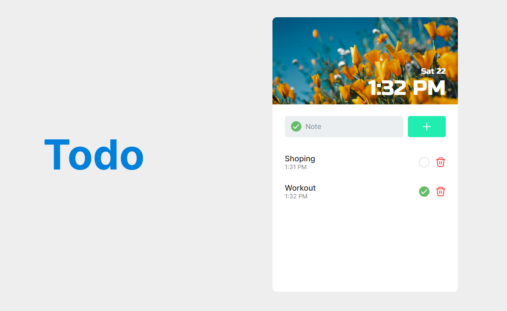

# Frontend Mentor - Todo app solution

This is a solution to the Todo app challenge on Frontend Mentor

## Table of contents

- [The challenge](#the-challenge)
- [Screenshot](#screenshot)
- [Links](#links)
- [Built with](#built-with)
- [What I learned](#what-i-learned)
- [Continued development](#continued-development)

### The challenge

Users should be able to:

- View the optimal layout for the app depending on their device's screen size
- Add tasks they have to do, check them as done or uncheck or delete the task completely.

### Screenshot

### Links

- Solution URL: [https://github.com/HarLey021/Todo-App]
- Live Site URL: [https://todo-app-orcin-seven.vercel.app/]

### Built with

- HTML
- CSS modules
- Flexbox
- [React](https://reactjs.org/) - JS library
- UUID

### What I learned

The main thing I learned from this project is using UUID, for searching and making changes to the specific components.

### Continued development

Using UUID skill is the thing I want to improve for more complex challenges in the future.
